dotnetcore-city-info
====================

A simple demo application that refreshes information about cities and shows the
results on a web page. This demonstrates severeal features of OpenShift
Container Platform.

.. contents:: **Contents;**

**Screenshot**

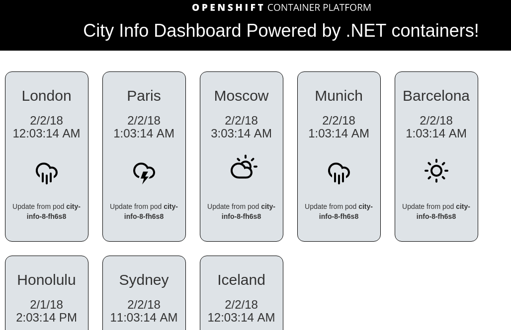

How to deploy this on OpenShift
===============================

In OpenShift Container Platform, you need to select **.NET Core Builder Images**
from the service catalog. If you are running OpenShift Origin, you can import 
this image builder into your service catalog by running `oc create -f ...` 
against these files; https://github.com/openshift/openshift-ansible/tree/master/roles/openshift_examples/files/examples/v3.7/image-streams

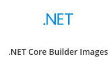

This should spawn the deployment wizard, click "Next >";

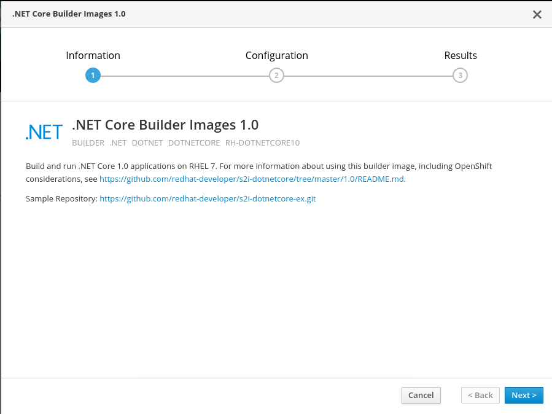

Complete the Wizard with the following details;

* **Add to Project:** Create Project
* **Project Name:** city-info
* **Project Display Name:**
* **Project Description:** ...
* **Version:** 2.0 - The screenshot above shows the OpenShift builder is version 1.0, however, this builder uses a compiler which is different for .NET Core 1.0 or .NET Core 2.0 projects. The version you are selecting here is the **compiler version**, and this is a .NET Core 2.0 project. Therefore it is very important to select version 2 builder. If you use select version 1 here by accident then it will expect a .NET Core 1.0 project.json files and similar that have been deprecated and the build would fail!
* **Application Name:** city-info
* **Git Repository:** https://github.com/jamesread/dotnetcore-city-info.git

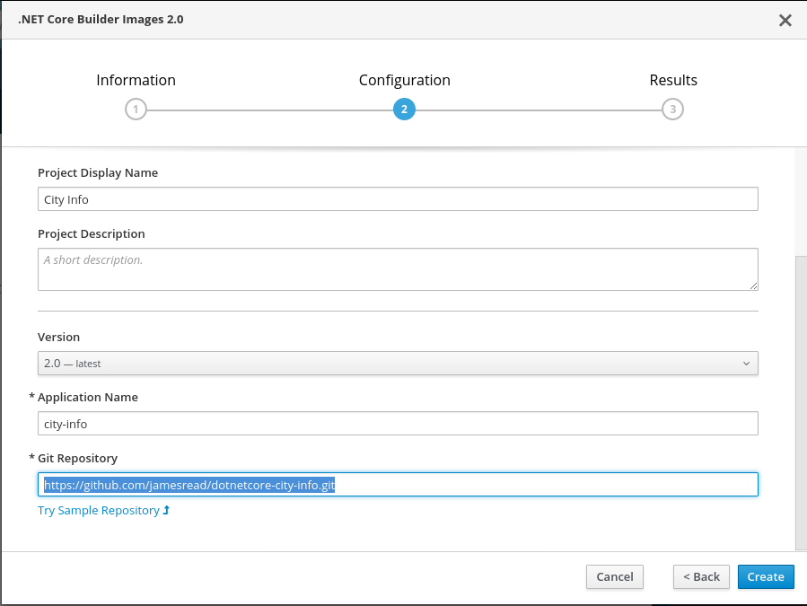

Once the project has been created, it should see a build start in the project overview;

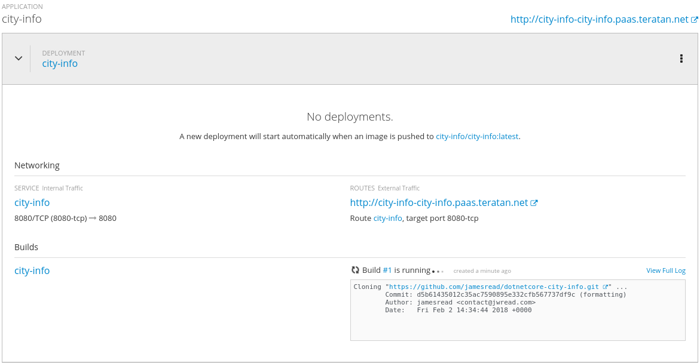

You are now ready to try out one or more of the demo scenarios!
   
Demo Scenarios
==============

Deploying a feature branch in a A/B deployment.
----

* Use the .NET Core Builder Image to deploy (the master branch) as normal. This
must be built with a v2.0 builder.

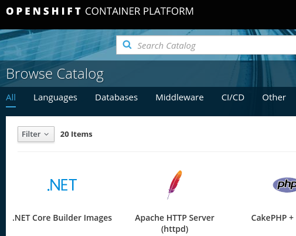

* Add to the project again, with a .NET Core Builder Image. This time, use an
**advanced options** to and specify the **feature_weather** branch.

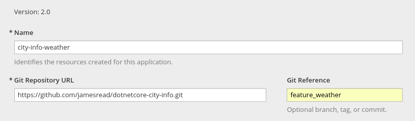

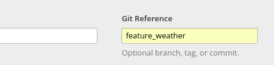

* Dot *not* deploy a new route.

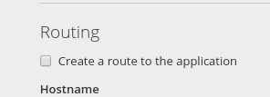

* You should have something that looks like this;

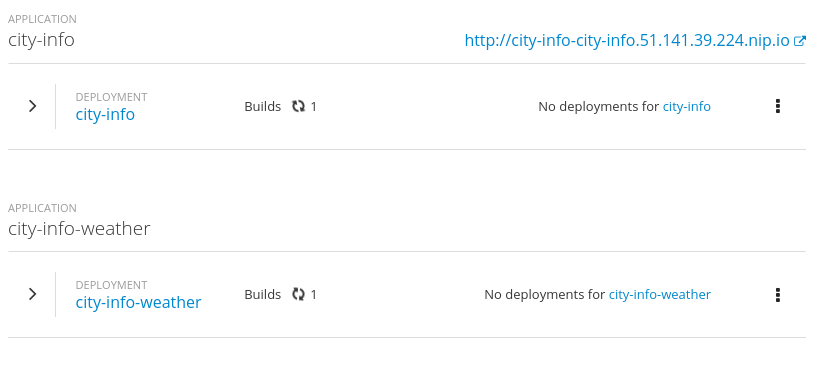

* Now go find the route, and edit it. You want to "Split traffic across
multiple services" and select the new feature branch.

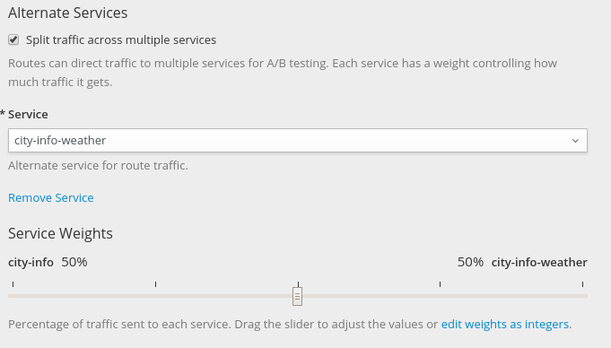

Once saved, it should look something like this;

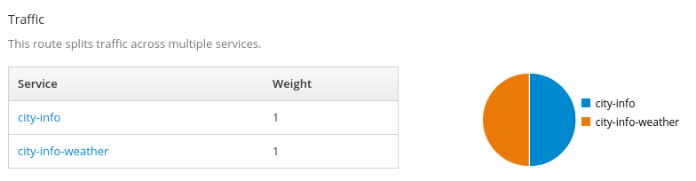

* Now go view the application. 

Press Ctrl + F5 to refresh the page. Half of the time, you'll get weather
icons, half of the time, you'll not get weather icons. Make sure Cookies are
disabled to disable session persistance. 

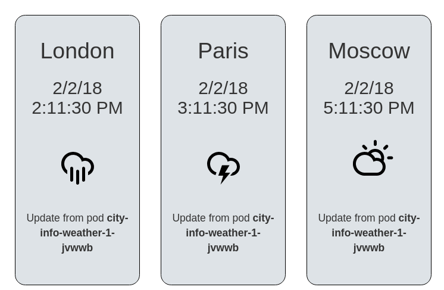

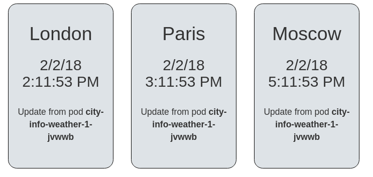

Making a application configuration change / Feature Toggles
----

# This C# dotnet application will check for the environment variable
SHOW_POPULATION as a means for enabling this feature in responses to requests
for city information. You should set this in the DeploymentConfig, and watch 
 OpenShift deploy a new version automatically.

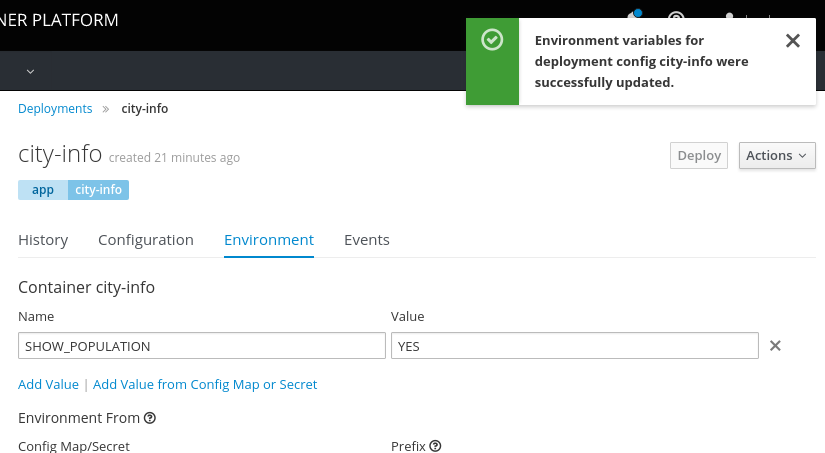

Scaling a deployment
----

TODO :) 
